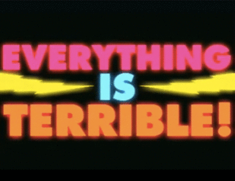

# Don't be a gitwit

---

# Why git?

*Wasn't this problem already solved?*

## The literal answer

Linus Torvalds needed something to manage the Linux kernel. The kernel is a
massive project with thousands of contributors trying millions of experiments
with a shifting hierarchy and a codebase so massive they couldn't keep it all
managed on one central repository if they tried.

---

# A better answer

We're not as huge as the Linux foundation, so again: *why git?*

1. Reality is an illusion

  Git operates on the assumption that you have multiple people working on
  overlapping subsets of the same codebase and that, at any given moment,
  no two people have compatible code.

  Hence, git is a *distributed version control system.* You have your own
  repository and unless you say otherwise there is no such thing as the
  "canonical" repository.

2. Branching should be easy.

  Want to try something new? Just branch. If it works - **great!** Merge it
  back into the parent. If it sucks - delete the branch and forget the whole
  embarrassing affair.

3. You should be able to create the workflow you need.

  Git is really 152 (or so) separate commands under one convenient wrapper.
  You can compose them any way you want to. It's the Unix Philosophy for
  version control.

---

# How does git work?

Magic.

Just kidding. Inside your git repository you'll find a hidden directory named
`.git`. It contains a configuration file (remote repository locations, etc) and
a bunch of diffs.

*That's it.*

---

# Branches, tags, and commits

A branch is just a textfile, somewhere inside `.git/` that contains a checksum
of the latest commit. Conveniently, commits are stored at these checksums. So
"switching to a branch" means "read a file, go to the set of diffs with this
checksum, apply them."

Every point in your history can be "checked out" just like a branch because
every commit you've ever made has a GUID. So you can totally
`git checkout 97fb475982e6` or similar.

---

# Staging and committing

Unlike most version control systems, git has a *staging* area. You stage a
change when you `git add` it.

*Protip: You can even stage portions of a file rather than the whole thing!*

When you actually *commit* changes, you are really taking a diff **from** your
current version of the file **to** the old version of the file. If you ever
have to rollback history, git will just apply the diffs until you arrive.

---

# Down to business

---

# Common commands

- `clone`
- `add`
- `commit
- `checkout`
- `branch`
- `fetch`
- `merge`
- `pull`
- `push`
- `log`
- `status`
- `rebase`

---

# clone

As discussed, git is very anarchist. So if you want to grab someone's code out
of a git repository, you're not "checking it out" or being granted access:
you're cloning their entire history. Then you can start adding your own
history in your own little parallel universe.

Usage:

    git clone https://somedomain/path/to/repo.git

    git clone git://somedomain/path/to/repo.git

    git clone git@somedomain:/path/to/repo.git

---

# add

This stages a change to be committed. Anything you want to commit, `add`.
Otherwise, don't.

Usage:

    git add somefile

    git add ./*

---

# commit

This actually commits the changes in your staging area to your local
repository. In git, everything in a branch is just a collection of diffs; if
you apply them in the correct order, you go back through time.

## Message

You have to include a commit message. You can do so with the `-m` switch.

    !bash
    git commit -m "Some commit message"

If you don't, git will hassle you by running your default editor and make you
type something and save it.

## add and commit at once!

If git is already tracking some files, then you can add and commit all changes
with the `-a` flag:

    !bash
    git commit -a -m "my commit message"

---

# Backdiff to the future!

---

# checkout

In SVN, `checkout` means "checkout what's at the server and put it here in
front of me."

In git, it really means "switch to a different branch." The naming is perhaps
unfortunate, but it does make sense: I want to check out this branch to see
what is in it and make changes.

You can checkout local and remote branches.

Local:

    !bash
    git checkout somelocalbranch

Remote:

    !bash
    git fetch remotename
    git checkout remotename/somebranch

*We'll get to `fetch` in a moment.* The "Remote" commands essentially brings
down server branches without modifying any of your local branches.

---

# You know, I always see "checkout" ...

... but never a **checkin** command. What's up with that, amirite?

*I almost went with a Hotel California joke; regrets.*

---

# branch

The branch command can do several things:

- List branches: `git branch`
- Create a new branch: `git branch branchname`
- Delete a branch: `git branch -D branchname`
- List only remote branches: `git branch -r`
- List local and remote branches: `git branch -a`

## A neat trick with `checkout`

Create a branch and check it out at the same time:

    !bash
    git checkout master
    git checkout -b gatlin/featureOne
    vim somefile.py
    git commit -a -m "finished featureOne"
    git checkout master
    git merge gatlin/featureone

The `-b` switch for `checkout` is pretty nifty.

---

# fetch

We saw `fetch` earlier. `fetch` retrieves (or, in our colloquial parlance,
*fetches*) the state of another repository but does not change the state of
your local repository.

There is more to say about fetch. I'll leave this for a later presentation.

Usage:

    git fetch remoteserver

This will look up the server you call "remoteserver" in your `.git/config` file
and fetch its current state. Then I can access its branches like so:

    git checkout remoteserver/branchname

---

# merge

To `merge` is to take the state of another branch and merge it with the state
of the current branch.

Usage:

    git merge srcbranch

Think of it this way: wherever I am, if I want to bring in changes, I use
`merge`.

## Conflicts!

You will sometimes have conflicts. Git will fail loudly for you and tell you
that you must resolve them.

*For this reason `merge` does not automatically commit anything unless you tell
it to.*

To resolve conflicts:

1. Go to the files git labeled as problematic
2. Make the file look like what you want it to look like
3. `git add` and `git commit` those files.

If you decide it's not worth it,

    git merge --abort

---

# pull

Here is a common workflow:

    !bash
    git fetch remoteserver
    git checkout myownbranch
    git merge remoteserver/branchname

It's so common that git has a special name for this combination: **pull**.

Usage:

    git pull remoteserver branchname

It's just fetch and merge.

---

# push

So far all the commands have been "bring me something" types of commands. I
merge from your branch into my branch; I fetch from your repository into my
repository, etc.

If you want a semi-centralized workflow, though (and we do), then git has a
command for pushing your branch to a remote repository.

Usage:

    git push remoteserver localBranchName

---

# log and status

These are pretty simple. To see a history of your commits and commit messages:

    git log

To see what is staged, unstaged, waiting to be commited, etc in your current
working directory:

    git status

---

# rebase

The dreaded rebase. **EVERYBODY PANIC.**

Actually, don't. It's not that bad. Rebase is like merge *except* instead of
merging in the traditional sense, it

1. undoes everything you have committed to the point that you last rebased (or
   branched)

2. applies changes until your branch is where the server is

3. applies your changes on top of this new foundation.

So, your changes were initially based off some state of another branch. A
`rebase` makes it so that your changes are based off a newer state.

## When to use `rebase`

Rebase from some authoritative, more important branch down to lesser ones. So

    git checkout gatlin/myfeature
    git rebase dev

Not the other way around.

## Squashing commits

You can "rebase" from an earlier point in history.
